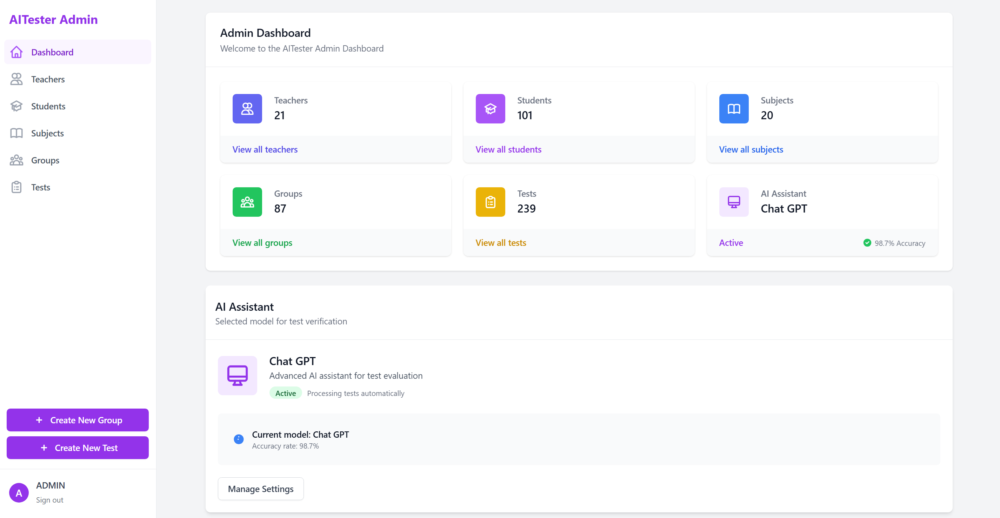
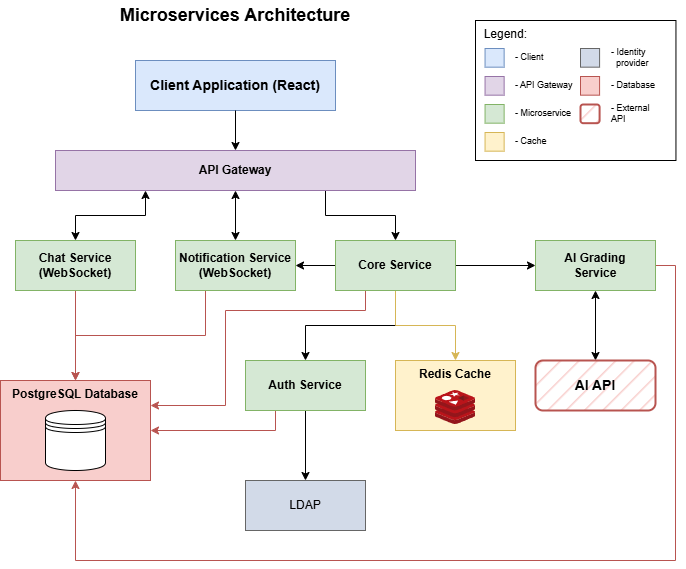
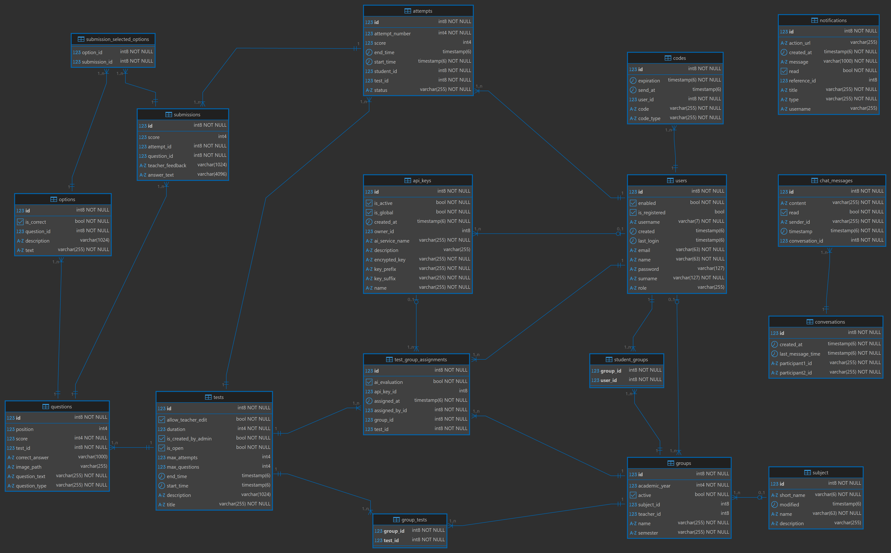

# Altester

## Documentation Links

In future---
- [Setup and Installation Guide]()
- [Environment Configuration]()
- [API Documentation]()
- [Deployment Guide]()

## Overview

Altester is a modular, scalable educational platform built with a microservices architecture. The platform streamlines test creation, administration, evaluation, and analysis for educational institutions. It supports advanced test management, role-based access control, real-time communication, and AI-powered grading capabilities.

## Technology Stack

### Backend
- **Java 21** - Latest Java version for all microservices
- **Spring Boot 3.4.x** - Core application framework
- **Spring Security** - Authentication and authorization
- **Spring Data JPA** - Data access and persistence
- **PostgreSQL** - Primary database for all services
- **JWT** - JSON Web Token authentication
- **WebSockets** - Real-time communications
- **Redis** - Caching
- **LangChain4j** - AI integration framework
- **LDAP** - Enterprise directory integration
- **Docker & Docker Compose** - Containerization and orchestration

### Frontend
- **React** - Frontend library
- **Responsive Design** - Mobile and desktop support

## Microservices Architecture

Altester follows a microservices approach with the following components:

## Database 

## Microservices Details

### 1. Authorization Service
**Main responsibilities:**
- Account creation and management
- Multiple authentication methods:
    - Local username/password
    - LDAP integration
- Password management (reset, change)
- Email verification via OTP
- JWT token generation

**Technologies:**
- Spring Boot 3.4.1
- Spring Security
- Spring LDAP
- JWT (jjwt 0.11.5)
- Thymeleaf (email templates)

### 2. Chat Service
**Main responsibilities:**
- Real-time messaging between users
- Role-restricted communication
    - Students can only message their assigned teachers
    - Teachers can message students in their groups
- Conversation history management

**Technologies:**
- Spring Boot 3.4.4
- WebSocket (STOMP)
- JWT authentication
- Real-time message delivery

### 3. Notification Service
**Main responsibilities:**
- System-wide notifications
- User-specific alerts
- Real-time delivery
- Notification history and management

**Technologies:**
- Spring Boot 3.4.4
- WebSocket for real-time updates
- Notification persistence and retrieval

### 4. AI Grading Service
**Main responsibilities:**
- Automated assessment of free-text responses
- Integration with test workflow
- Intelligent evaluation based on configurable criteria

**Technologies:**
- Spring Boot 3.4.4
- LangChain4j
- AI model integration

### 5. Core Service
**Main responsibilities:**
- Central business logic coordination
- Test creation and management
- Question management (multiple formats)
- Student, teacher, and group management
- Test attempt management
- Academic period configuration

**Technologies:**
- Spring Boot 3.4.2
- Redis for distributed caching
- Advanced business logic implementation

## User Roles and Features

### Admin
- Comprehensive user management
    - Student and teacher accounts
    - LDAP integration (student accounts from LDAP are immutable)
- Subject and group management
- Semester configuration via environment variables
- Full test lifecycle management
    - Creation, updates, deletion
    - Teacher assignment
- Question management (5 types)
    - Text only
    - Text + image
    - Image only
    - Multiple choice
    - Multiple choice + image
- Student performance analysis by test and group
- System-wide configuration and monitoring

### Teacher
- Access to assigned groups and students
- Test creation and management
    - Create new tests
    - Edit owned or delegated tests
- Student submission evaluation
- Direct messaging with students
- Notification reception for relevant events

### Student
- Access to current semester groups
- Test participation
    - Take active tests
    - Resume attempts within time limits
- View test history across semesters
- Communicate with assigned teachers
- Receive system and test notifications

## Universal Features
- Self-service account management
    - Password changes
    - Email changes with confirmation
- Comprehensive pagination across all list views
- Real-time notifications

### Environment Configuration
Each service uses environment variables for configuration, defined in `.env` files. For complete configuration reference, see our [Environment Configuration Wiki](https://github.com/altester/altester/wiki/Environment-Configuration).

