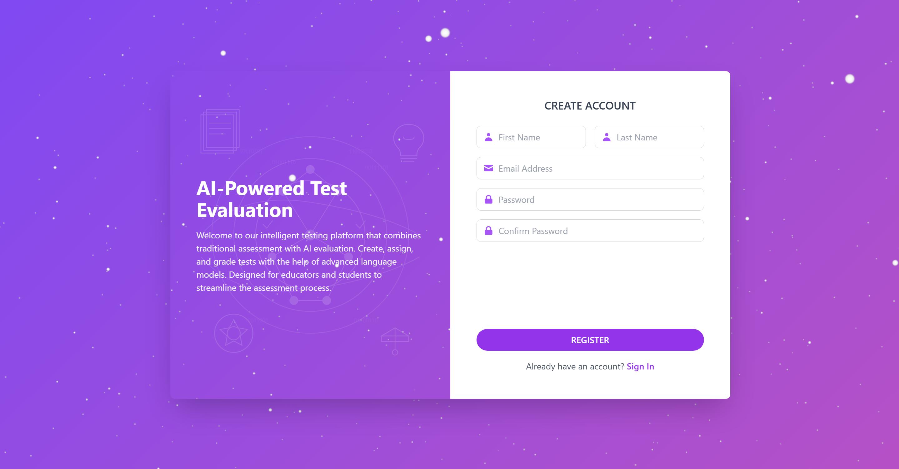
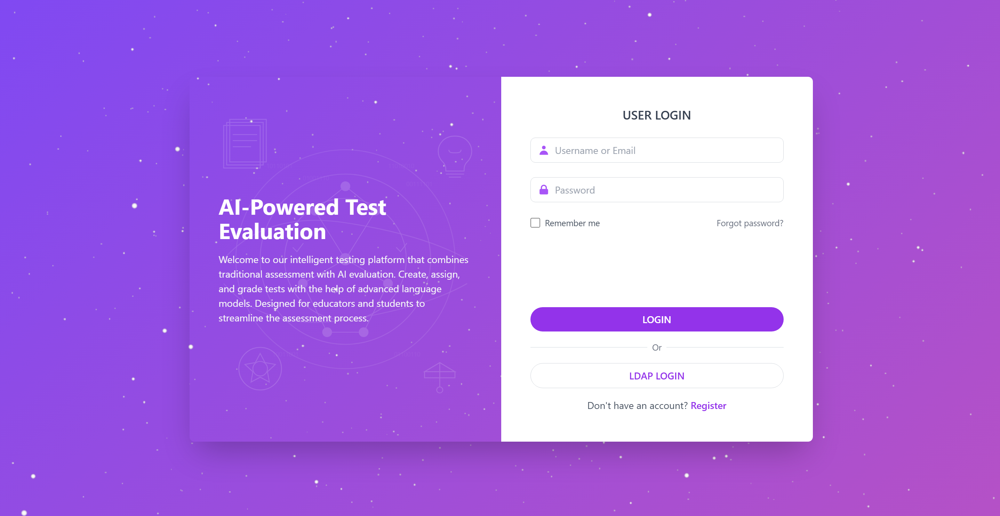
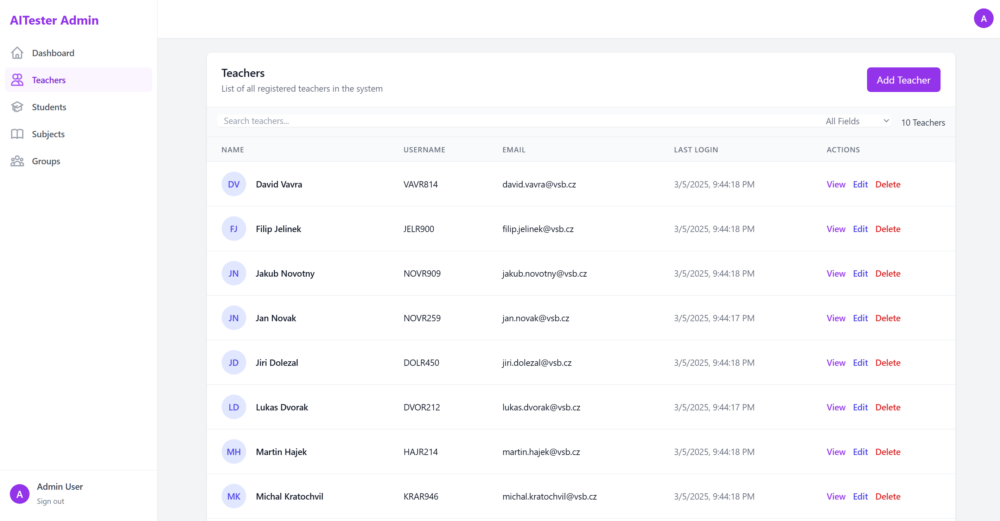

Возможность добавления и редактирования вопросов у тестов + нельзя менять тесты вопросы из тестов из пред семестра.

Добавить поиски в контроллеры для учителя

копирование теста в группу(ы) или по сабджект айди игнорируя неактивные группы.

Улучшить иницилазицю а так же добавить админ пароль в енв.

Зарегестрированный учитель может менять пароль и почту.

Страница студента и профиль.

Вебсокеты

Реквест на перепроверку в течении недели.

Админ и учитель просматривать все попытки ученика на тест, возможность оценивать (нельзя оценивать из прошлых семестров).

Добавь контроллер, сервис и все что нужно для добавления, управления удаления
вопрсоов у тестов, а атк же получения, с пагинацией,

Ты можешь менять поля у моделей но не можешь менять связи между моделями.

Вопросы не могут быть добавлены, изменены или удалены из тестов котоыре нахоядться
в группах прошых семестров.

Учитель не может добавить, изменять удалять вопросы из тестов к окторым у нхи нету доступа.

Есть несколько типов вопросов, только текст, текст + варианты выбора, картинка и картинка + текст
картинки сохраняй локально на бекенд.

Some screenshots from front end

